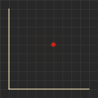

# gcompiler

A simple compiler for the G description language for simple graphs, written in Rust.

**Table of Contents**
- [gcompiler](#gcompiler)
  - [What is G?](#what-is-g)
  - [G Descriptions](#g-descriptions)
    - [Functions](#functions)
      - [`@line`](#line)
      - [`@point`](#point)
      - [`@graph`](#graph)
  - [Comments](#comments)
  - [Usage](#usage)
  - [License](#license)


## What is G?

G is a simple language for describing graphs. It is a simple language that is easy to read and write, and is designed to generate graphs output in svg format and png format. Can be used to generate graphs for use in documentation (i.e. Markdown files), or for use in other applications.

The **gcompiler** compile G files into svg or png files.

## G Descriptions

Each `.g` files contains a `#root` declaration and a defined `x` and `y` axis.

A simple graph description looks like this:

```oz
#define x
    min 0
    max 200
    name "x"
#end

#define y
    min 0
    max 200
    name "y"
#end

#root
    box 0, 0, 200, 200
    color 0xebdbb2
    background 0x282828
    axis x, y
#end

% optional grid %

#grid
    color 0x3c3836
    step 10
    alpha 1
#end
```

This will generate a graph with a box of size 100x100, with the x and y axis defined by the `x` and `y` definitions.

The `x` and `y` definitions define the axis of the graph. They are defined by the `min` and `max` values, and the `name` of the axis. The `name` is used to label the axis.

The `min` value is optional, and defaults to 0. The `max` value is not optional, and must be defined.

The `#root` declaration defines the root of the graph. It is required, and must be defined.

The `box` declaration defines the size of the graph. It is required, and must be defined.

The `axis` declaration defines the axis of the graph. It is required, and must be defined.

The `#grid` declaration defines the grid of the graph. It is optional, and can be defined.

<figure>
<div align="center">

[](examples/simple.g)
<figcaption> 

*Simple Graph* 
</figcaption>

</div>
</figure>

### Functions

The G description language supports functions. You can't define your own functions, but you can use the built-in functions.

The built-in functions are:
  - `@line` Draws a line from one point to another.
  - `@point` Draws a point at a given point.
  - `@graph` Draws a graph of a given function.

#### `@line`

The `@line` function draws a line from one point to another.

```oz
@line
    from 0, 0
    to 100, 200
    name "line"
    color 0xebdbb2
#end
```

- `from` is either an `INT` or a `FLOAT`

- `to` is either an `INT` or a `FLOAT`. 

- `name` is optional

- `color` is optional.

<figure>
<div align="center">

[](examples/line.g)
<figcaption>

*Line Graph*
</figcaption>

</div>
</figure>

#### `@point`

The `@point` function draws a point at a given point.

```oz
@point
    at 50, 50
    color 0xcc241d
#end
```

- `at` is either an `INT` or a `FLOAT`
- `name` is optional
- `color` is optional

<figure>
<div align="center">

[](examples/point.g)
<figcaption>

*Point Graph*
</figcaption>
</div>
</figure>

#### `@graph`

The `@graph` function draws a graph of a given function.

```oz
@graph
    color 0xfabd2f
    func "sin(x * 0.1) * 90 + 90"
#end
```

- `name` is optional
- `color` is optional
- `thickness` is optional
- `func` is required. It is a string that is a valid mathematical function. The function can use the following operators:
  - `+` Addition
  - `-` Subtraction
  - `*` Multiplication
  - `/` Division
  - `^` Exponentiation
  - `()` Parentheses
  - `x` The x value

> see [exmex](https://github.com/bertiqwerty/exmex/) for more information on valid mathematical functions.

<figure>
<div align="center">

[](examples/graph.g)
<figcaption>

*Graph Graph*
</figcaption>
</div>
</figure>

## Comments

Comments are supported in G files. Comments are started and ended with `%`

```oz
% This is a comment %
```

## Usage

A simple command line interface is provided for compiling G files.

```bash
gcompiler compile examples/simple.g
```


## License

Apache-2.0 license. See [LICENSE](LICENSE) for more information.
